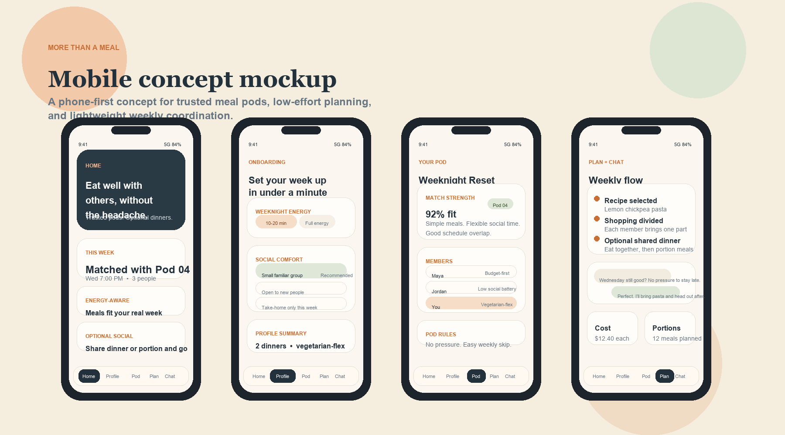

# More Than a Meal

More Than a Meal is a Supabase-backed Next.js prototype for low-effort social meal prep. It lets multiple people create accounts, save onboarding preferences, join the same demo pod, vote on recipes, update tasks, leave feedback, and message inside the pod.

## What This Version Includes

- Email/password sign up and sign in with Supabase Auth
- Shared onboarding profile data in Postgres
- A seeded live demo pod that multiple testers can join
- Recipe voting, meal-mode selection, and portion count updates
- Task tracking, feedback, and pod chat
- Mobile-first UI inside a phone-style shell

## Tech Stack

- Next.js App Router
- TypeScript
- Supabase Auth
- Supabase Postgres

## Screens



## Local Setup

1. Create a Supabase project.
2. Copy `.env.example` to `.env.local`.
3. Add your project values:

```bash
NEXT_PUBLIC_SUPABASE_URL=your-supabase-project-url
NEXT_PUBLIC_SUPABASE_PUBLISHABLE_KEY=your-supabase-publishable-key
```

4. Open the Supabase SQL editor and run:

```sql
-- contents of supabase/schema.sql
```

That file creates:
- `profiles`
- `pods`
- `pod_members`
- `recipe_options`
- `recipe_votes`
- `tasks`
- `feedback`
- `pod_messages`

It also seeds a shared `demo-pod` so your friends can test the same pod together.

5. Install dependencies and start the app:

```bash
npm install
npm run dev
```

6. Open [http://localhost:3000](http://localhost:3000)

## Try It With Friends

1. Deploy the app to Vercel.
2. Add the same two env vars in the Vercel project settings.
3. Share the live URL with your friends.
4. Have everyone create an account and join the demo pod.

Because the app uses a shared Supabase database, everyone who signs in will see the same pod updates in the same backend.

## Important Note

This is a prototype-quality backend, not a production-hardened system. The current row-level security policies are intentionally permissive to make class testing easy. Before using this beyond demo/testing, tighten the policies and add stronger role checks.

## Key Files

- [src/app/page.tsx](./src/app/page.tsx): main app UI and client-side Supabase logic
- [src/app/page.module.css](./src/app/page.module.css): app styling
- [src/lib/supabase/client.ts](./src/lib/supabase/client.ts): Supabase browser client
- [supabase/schema.sql](./supabase/schema.sql): schema, policies, and demo seed data
- [.env.example](./.env.example): required environment variables
